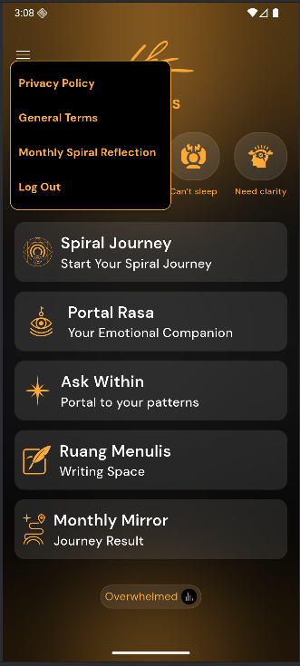
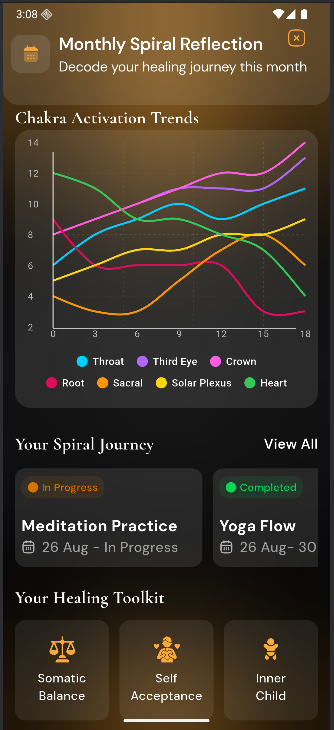

I like how you’ve framed the **Apartment Inspection App** readme — neat sections, consistent style, a good balance of tech detail and friendliness.
Here’s a version tailored for **Kunci Hidup = Chakra Quiz App**, swapping in the right stack (Flutter + Django backend) and flavor:

---

# 🧘‍♂️ Kunci Hidup — Chakra Quiz App

A calming and interactive **Chakra Quiz Application** built with **Flutter** for the frontend, powered by a **Django REST API backend**, and managed with **GetX** for smooth state handling.
Designed to help users explore their energy balance and self-awareness through chakra-based quizzes.

---

## ✨ Features

* 🧩 Take chakra-aligned quizzes with insightful questions
* 📊 Get instant chakra balance results with visual feedback
* 🎨 Beautiful and responsive UI with Flutter
* ⚡ Reactive and efficient navigation with GetX
* 🌐 Django REST API backend for quiz management and data storage
* 💾 Local data persistence with SharedPreferences
* 🔐 Secure authentication and user profiles
* 🔔 Notification-ready architecture (optional future expansion)
* 🧹 Clean, modular, and scalable codebase

---

## 📱 Screenshots

|               Login Screen              |              Hoome Screen             |               Data Screen              |
| :--------------------------------------: | :----------------------------------: | :--------------------------------------: |
|  |  |  |

---

## 🛠️ Built With

* **Flutter** — Cross-platform app framework
* **Django REST Framework** — Backend API
* **GetX** — State Management & Routing
* **SharedPreferences** — Local storage
* **Dart** — Frontend programming language
* **Python** — Backend programming language

---

## 🧩 Architecture Overview

```plaintext
lib/
├── controllers/      # GetX controllers for quiz logic & state
├── models/           # Data models (User, Quiz, ChakraResult)
├── services/         # Django API & local storage services
├── views/            # UI screens and widgets
├── utils/            # Components, themes, constants
└── main.dart         # App entry point
```

> Backend lives in a separate **Django project**, exposing REST APIs for authentication, quizzes, and results.

---

## 🚀 Getting Started

Follow these steps to run the project locally:

### 1. **Clone the repository**

```bash
git clone https://github.com/yourusername/kunci-hidup-chakra-quiz.git
cd kunci-hidup-chakra-quiz
```

### 2. **Install Flutter dependencies**

```bash
flutter pub get
```

### 3. **Setup Django Backend**

* Clone or open the Django backend repo (if separate).
* Install dependencies:

```bash
pip install -r requirements.txt
```

* Run migrations & start server:

```bash
python manage.py migrate
python manage.py runserver
```

* Default API runs at: `http://127.0.0.1:8000/api/`

### 4. **Connect Flutter app to backend**

Update your API base URL in the Flutter app’s `services/api_service.dart`.

### 5. **Run the app**

```bash
flutter run
```

---

## 🔑 Environment Configuration

* Store API endpoints and secrets securely.
* Consider using `.env` files or `flutter_dotenv` for environment management.

---

## 📈 Future Improvements

* 📋 Personalized chakra reports (PDF export)
* 🎶 Sound therapy recommendations based on results
* 📲 Push notifications for daily quiz reminders
* 🌐 Multi-language support
* 🎨 Dark Mode

---

## 🤝 Contributing

Contributions are welcome! 🎉
Please fork this repository, create a feature branch, and submit a pull request.

```bash
# Create a feature branch
git checkout -b feature/YourFeature

# Commit your changes
git commit -m 'Add some feature'

# Push to the branch
git push origin feature/YourFeature
```

---

## 📄 License

This project is licensed under the [MIT License](LICENSE).

---

## 💬 Connect with Me

* [LinkedIn](https://www.linkedin.com/in/s4k1l)

---

> **Crafted with 🌸 mindfulness using Flutter, Django, and GetX.**

---

Would you like me to also draft the **README section for the Django backend** (API endpoints, setup, etc.) so both repos stay in sync?
